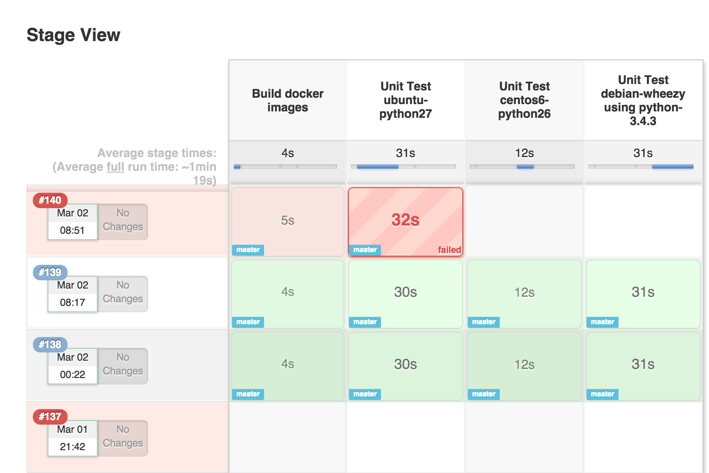
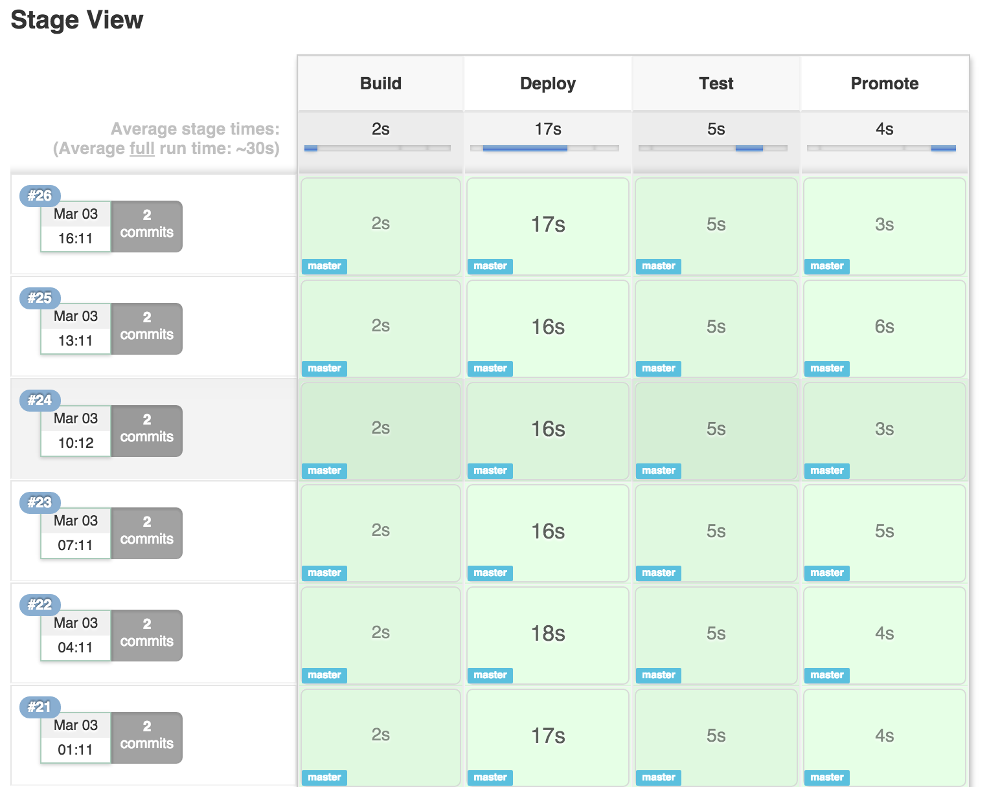

# Pipeline Stage View Plugin

[](https://plugins.jenkins.io/pipeline-stage-view)
[](https://github.com/jenkinsci/pipeline-stage-view-plugin/blob/master/CHANGELOG.md)
[](https://plugins.jenkins.io/pipeline-stage-view)

## Version history

See [the changelog](https://plugins.jenkins.io/pipeline-rest-api/#releases)

# Stage View: 

## 

## 

When you have complex build Pipelines, it is useful to be able to see
the progress of each stage.  The Pipeline Stage View plugin includes an
extended visualization of Pipeline build history on the index page of a
flow project, under *Stage View*. (You can also click on *Full Stage
View* to get a full-screen view.)

To take advantage of this view, you need to define stages in your flow.
You can have as many stages as you like, in a linear sequence. (They may
be inside other steps such as 'node' if that is convenient.) Give each a
short name that will appear in the GUI.

``` syntaxhighlighter-pre
node {
  stage ('Checkout') {
    svn 'https://svn.mycorp/trunk/'
    stage 'Build'
    sh 'make all'
    stage 'Test'
    sh 'make test'
  }
}
```

When you run some builds, the stage view will appear
with *Checkout*, *Build*, and *Test* columns, and one row per build.
When hovering over a stage cell you can click the *Logs* button to see
log messages printed in that stage: after the preceding stage step and
before the next one.

Other important events are also indicated with special buttons, either
in a stage cell or for the build as a whole. If a build is waiting in
an input step, you will be able to tell it to proceed (or
not). *Download* can be used to obtain any artifacts archived by a
build. 

Each row also records the build number, date it was started, and any
changelog entries from a version control system. Progress bars also
indicate how long each stage is taking and how long it might still be
expected to take, based on historical averages.

# Usage Notes/Limits:

-   Block-scoped stages (stages that take a closure, see below) may
    occur in parallels but are not displayed in parallel.

    ``` syntaxhighlighter-pre
    stage('name'){ echo 'steps here' }
    ```
    
-   **Dynamic stages**: in general, if you want to visualize dynamically
    changing stages, make it conditional to execute the stage contents,
    not conditional to **include** the stage\*\* Stage view can handle a
    limited subset of cases where you're appending additional stages,
    but the cell-based view is not matched to changing stage structures 
-   Configurable limits are provided for the REST API that drives stage
    view -- these may be overridden though (see below).
-   The pipeline stage view uses caching internally for performance:
    even if the first viewing is slow, following ones should be quite
    fast

# Configurable Properties:

-   At runtime or startup, you may turn off Jenkins user lookup for
    changesets with property
     `com.cloudbees.workflow.rest.external.ChangeSetExt.resolveCommitAuthors`

    -   This is a workaround for rare cases where you are relying on an
        external security realm for user information and have
        performance issues with many calls:
    -   In the script console this setting may be changed at runtime
        (with immediate impact):

        ``` syntaxhighlighter-pre
        System.setProperty("com.cloudbees.workflow.rest.external.ChangeSetExt.resolveCommitAuthors","false");
        ```

    -   To turn user lookup back on: 

        ``` syntaxhighlighter-pre
        System.setProperty("com.cloudbees.workflow.rest.external.ChangeSetExt.resolveCommitAuthors","true");
        ```

-   Hardcoded API limits that may be overridden by setting the
    properties at startup (requires restarting Jenkins to see the
    change):
    -   Characters in each step's log entry (default: 10240 or 10kB) -
        `com.cloudbees.workflow.rest.external.FlowNodeLogExt.maxReturnChars`
    -   Runs displayed per job (default: 10)
        - `com.cloudbees.workflow.rest.external.JobExt.maxRunsPerJob`
    -   Artifacts shown per run (default: 100)
        - `com.cloudbees.workflow.rest.external.RunExt.maxArtifactsCount`
    -   Steps displayed per stage (default: 100)
        - `com.cloudbees.workflow.rest.external.StageNodeExt.maxChildNodes` -
        note: this may have a very large performance impact with complex
        builds.

