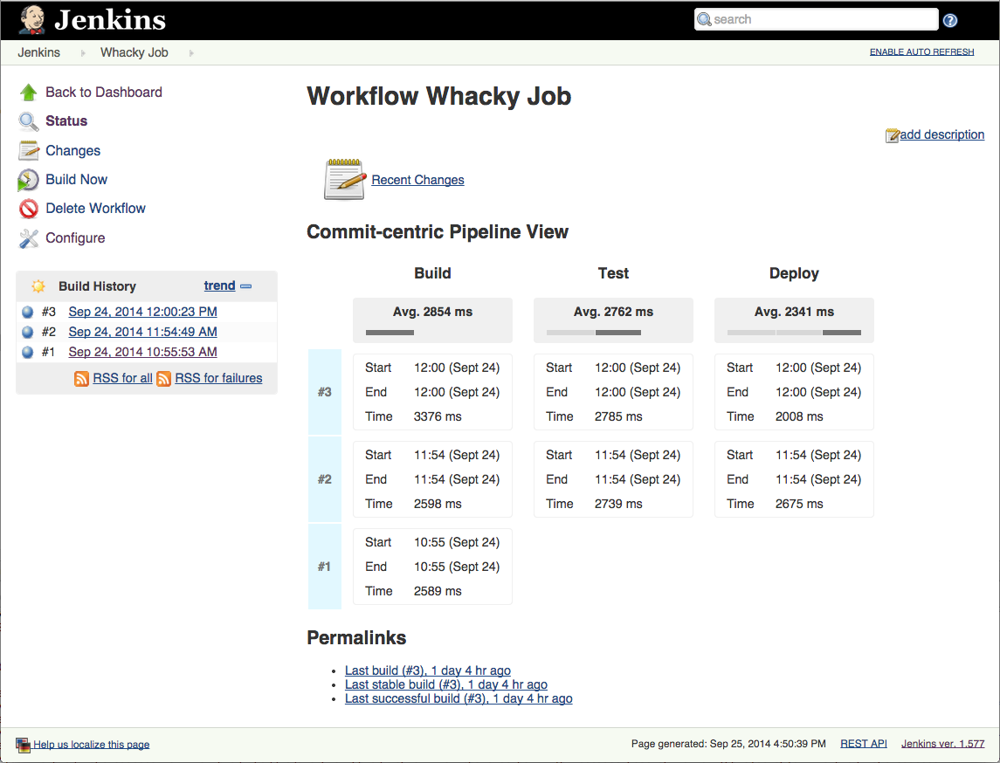
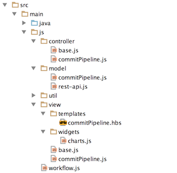

# Pipeline Stage View

This plugin provides Jenkins UI Pipeline "Visualizations":

## Working with Pipeline Visualizations

The following steps outline the the high-level process that's currently involved when adding/modifying Pipeline
Visualizations:

1. Set up your build environment.
1. Import these projects into your IDE.
1. Understand the building-blocks used to build Pipeline Visualizations.

### Build Environment

If you're already working with Jenkins related projects then you'll already have most of what you need (Java, Maven, Git etc).

We use some [node.js][nodejs] build tools, so you'll need to install that, if you haven't already.  Note that
[node.js][nodejs] does not need to be installed if you just want to build the project (the build will get a copy
for itself).  You only need to install it on your dev machine if you're planning on working with some of the Pipeline
visualizations.

After installing node and the node package manager (NPM), you should also install the [gulp.js](http://gulpjs.com/) package:

```
npm install --global gulp
```

### mvn hpi:run + gulp "watch"

Note that if you want your JavaScript changes (more on this later) to be picked up by the HPI plugin at runtime, please
run the following command from inside the `ui` folder (i.e. this plugin's source folder).

```
gulp watch
```

This watches for JavaScript and [Handlebars][Handlebars] template changes and runs [Browserify][Browserify] as needed.
See [README for more][js_testing].

### Building Blocks

This plugin builds its visualizations using a mixture of Jelly and JavaScript.  It's structure is probably a bit different to
most other Jenkins UIs in that it (intentionally) uses less Jelly and more JavaScript.  The hope is that if you're used to using modern
UI build and runtime tools, then you'll hopefully find it easier to work with Pipeline visualizations.

#### The Jelly Bits
As said, we're intentionally trying ti use less Jelly, however we can't eliminate it completely.  We need to add Jenkins/Hudson
model objects (e.g `Action`s etc) in order to create the relevant UI extension points.  Then, we add the corresponding Jelly templates
that just create the Jenkins "widget" markup elements (the UI hooks for the client-side JavaScript code).

As an example, lets look at how we inject the "Pipeline Stage View" onto the Pipeline job page (`/job/<jobname>`).
If you look at the Pipeline job page on OSS Jenkins you'll see something like the following.


This view is generated through Jelly contributions from the `WorkflowJob` model object and specifically it's [`main.jelly`][main_jelly] file.

The following is [`main.jelly`][main_jelly] as it currently is (at time of writing) with comments etc stripped out.

```xml
<!-- main.jelly -->
<j:jelly xmlns:j="jelly:core" xmlns:st="jelly:stapler" xmlns:p="/lib/hudson/project" xmlns:t="/lib/hudson">
    <p:projectActionFloatingBox/>
    <table style="margin-top: 1em; margin-left:1em;">
        <t:artifactList caption="${%Last Successful Artifacts}" build="${it.lastSuccessfulBuild}" baseURL="lastSuccessfulBuild/" permission="${it.lastSuccessfulBuild.ARTIFACTS}"/>
        <t:summary icon="notepad.png" href="changes">
            ${%Recent Changes}
        </t:summary>
    </table>
    <j:forEach var="a" items="${it.allActions}">
        <st:include page="jobMain.jelly" it="${a}" optional="true" />
    </j:forEach>
</j:jelly>
```

The last few lines are the most important part as far as contributing the Pipeline Stage View to the Pipeline job page:

```xml
    <j:forEach var="a" items="${it.allActions}">
        <st:include page="jobMain.jelly" it="${a}" optional="true" />
    </j:forEach>
```

What this tells us is that if we implement an `Action` object and bind it to `WorkflowJob`, we can then create a
`jobMain.jelly` file for that `Action` implementation and it will be able to contribute to the above Pipeline job
page.

This plugin does just this:

* [__`WorkflowJobAction`__][WorkflowJobAction]: An `Action` implementation bound to `WorkflowJob`.
* [__`jobMain.jelly`__][jobmain_jelly]: `jobMain.jelly` owned by `WorkflowJobAction`.


```xml
<!-- jobMain.jelly -->
<j:jelly xmlns:j="jelly:core" xmlns:wf="/com/cloudbees/workflow">
    <wf:widget controller="pipeline-staged"/>
</j:jelly>
```

As promised, `jobMain.jelly` is lightweight (minimum Jelly) and just contains a `<wf:widget>` element. This is the
hook into the JavaScript "bits" (covered in the next section) but is enough to wire in the pipeline view.



#### The JavaScript Bits

As seen at the end of the last section, the glue between the Jelly and JavaScript building blocks is the `<wf:widget>`
Jelly tag.

```
<wf:widget controller="pipeline-staged"/>
```

The `controller` attribute probably hints at the fact that we are trying to follow a [Model View Controller (MVC)](http://en.wikipedia.org/wiki/Model%E2%80%93view%E2%80%93controller)
pattern with respect to how things are structured.  As yet, we are not using any of the JavaScript MVC frameworks (AngularJS, Backbone etc).
Instead, we've implemented a very simple MVC pattern.

The JavaScript code is organized into modules and folders along MVC principles:



You can see a series of folders with JavaScript files in each.  Each of these files is a [npm][nodejs]/[CommonJS][CommonJS]
style JavaScript module, which makes it very easy for us to organize/structure our JavaScript code in a modular fashion.  We use
[Browserify][Browserify] (a build time tool) to assemble all of these modules into a single .js file that the browser can load.

Using the Pipeline Stage view to show how the lightweight MVC pattern works at the moment, firstly you'll notice that we
have `controller`, `model` and `view` folders.  The MVC pattern for the Pipeline Stage view is managed around three modules:

1. [`controller/pipeline-staged.js`](src/main/js/controller/pipeline-staged.js): Responsible for wiring the Model and View together.
1. [`model/runs-stage-grouped.js`](src/main/js/model/runs-stage-grouped.js): Responsible for creating the Model data used by the View.  Note that the model could
be used by other views.  It's the job of the controller to pick a model that's compatible with the view etc.
1. [`view/pipeline-staged.js`](src/main/js/commit/pipeline-staged.js): Responsible for generating the view based on the Model data provided
to it by the Controller.  Views can use a combination of [Handlebars][Handlebars] templates (see the .hbs files) and [jQuery][jquery] to generate the rendered View.

#### Style (LESS -> CSS)
All styles are defined using [LESS].  The top level [`workflow.less`][workflow_less] file is located in the `src/main/less` folder.  It gets
preprocessed and bundled into the plugin as a CSS adjunct.

[LESS] allows us to:

1. Highly modularize the CSS.  CSS source files often end up being a maintenance mess.  Hopefully using [LESS} will help us avoid this.
1. Parameterize the CSS i.e. centrally define [LESS variables][variables_less] for styles that we'd like to maintain consistency for
across components e.g. colors, border styles etc.

Changes in `.less` source files are watched for and reprocessed in the same way as changes in `.js` files are watched for i.e. using the
`gulp watch` command.  See [JavaScript Testing][js_testing] for more information on this.

This will hopefully work nicely with the [uithemes-plugin](https://github.com/jenkinsci/uithemes-plugin) if and when that becomes a reality.

#### Testing UI Components
So far we've ben writing two types of tests for the UI components:

1. JavaScript based unit tests for testing the JavaScript components.  These tests are more lightweight and should run more quickly (no Jenkins instance, no browser env).
Please see the [JavaScript Testing][js_testing] docs.
1. More coarse grained Java based function tests using a combination of [`JenkinsRule`][JenkinsRule] and [PhantomJS] (headless browser)
e.g. [`WorkflowJobActionTest`][WorkflowJobActionTest].  Extend [`AbstractPhantomJSTest`][AbstractPhantomJSTest] for these types of test.
[`JenkinsRule`][JenkinsRule] allows us to create pipelines in a Jenkins instance embedded in the test, while [PhantomJS] allows us to
request the relevant pages to be tested from that Jenkins instance.
    * Note you must have PhantomJS [installed on your local machine](http://phantomjs.org/download.html).  We might look at using [phantomjs-maven-plugin](https://github.com/klieber/phantomjs-maven-plugin).
    * Note you can also use the [`WebClient`][WebClient] to mimic web interactions, but you might find it to be a headache with respect
    to it being overly picky about JavaScript (raising variable resolution failures etc not seen on any real browser).

[main_jelly]: https://github.com/jenkinsci/workflow-plugin/blob/master/job/src/main/resources/org/jenkinsci/plugins/workflow/job/WorkflowJob/main.jelly
[WorkflowJobAction]: src/main/java/com/cloudbees/workflow/ui/view/WorkflowJobAction.java
[js_testing]: src/test/js/README.md
[jobmain_jelly]: src/main/resources/com/cloudbees/workflow/ui/view/WorkflowJobAction/jobMain.jelly
[widgettag_jelly]: src/main/resources/com/cloudbees/workflow/widget.jelly
[Handlebars]: http://handlebarsjs.com/
[Browserify]: http://browserify.org/
[jquery]: http://jquery.com/
[nodejs]: http://nodejs.org/
[CommonJS]: http://wiki.commonjs.org/wiki/CommonJS
[JenkinsRule]: http://javadoc.jenkins-ci.org/org/jvnet/hudson/test/JenkinsRule.html
[PhantomJS]: http://phantomjs.org/
[WebClient]: http://javadoc.jenkins-ci.org/org/jvnet/hudson/test/JenkinsRule.WebClient.html
[WorkflowJobActionTest]: src/test/java/com/cloudbees/workflow/ui/view/WorkflowJobActionTest.java
[AbstractPhantomJSTest]: src/test/java/com/cloudbees/workflow/ui/AbstractPhantomJSTest.java
[LESS]: http://lesscss.org/
[workflow_less]: src/main/less/workflow.less
[variables_less]: src/main/less/variables.less
